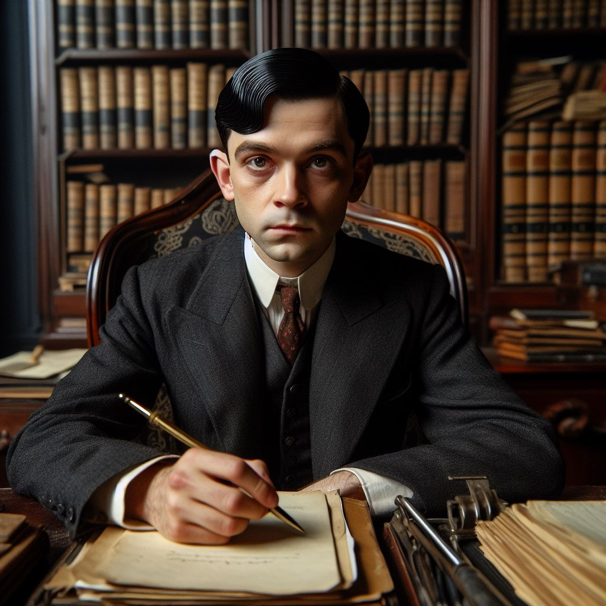



## Louis Webb

A strange lawyer in his 40s. He works mainly with low-level crooks, but has a few important clients (mafia bosses and such).

## Session 1

We woke up in Bob's boat. Couldn't remember anything, but there were loads of dead fish around us and an odd trinket. It looked like a white oval rock. It was warm to the touch and steaming. As soon as I touched it, it squirmed. This startled me, so I dropped it.

Bob turned the boat around and I put the trinked away. Back on land we went to the church. In there we met Padre Augustin and he was expecting us with the relic. Apparently he sent us on Sunday with the "sacred text" to the museum to get the relic and the complete the ritual to charge the relic. It is now Wednesday and we have a charged relic, but it's not "right". We don't have the text nor our memories. We'll have to go out to find both.

So we visited the pub. Had two drinks and spoke with the locals. Bob's crew was there, worried about him. Ginger, the bartender, said something had gone missing from the museum and the sheriff was hoping this to be his big opportunity. Solomon even sold a bible! After two drinks we went to the museum.

As we were standing in fron of the museum, it all came back. (we are now playing that night)

Solomon suggested we fake a document to get Sussanna, the librarian's (Betty) daughter. He crafted a fake map with reference's to some local pirate. Bob and I spent all day in town enjoying the market and the lake.

In the musum, they didn't buy it. She instantly knew it was a forgery, but was interested in the bottle. Solomon created a distraction and I managed to open a window just a bit for us to sneak in tomorrow.

We spent the night at my place, had dinner and studied the ritual for tomorrow. Very disturbing stuff, but we figured out the process.

Anyways, back at the museum we climbed in through the open window. While Solomon and I searched through the shelves, Bob found the index. Great! The item was in the safe. Not so great... While Solomon and I searched for some combination or tool to open it, Bob found the safe was already open. It had not been closed properly. I'm starting to see a pattern here...

Inside the safe we found the relic, but someone was coming down the stairs so we closed the door as John Gunnerson slipped on the oil Solomon had poured on the stairs. We waited for about 20 minutes, and then John opened the door... and was received by a shot in the chest. Solomon killed him, and then Bob threw a box on top of him. Mangled corpse, blood spreading quickly, so I told everyone to avoid stepping on the blood and quickly leave. We broke the window from the outside to make it look like a robbery. Which it was... but it makes the culprit less obvious.

Someone must have heard the window breaking, as they came running, but we ran around a corner and were not seen. We ended the night in Bob's boat.